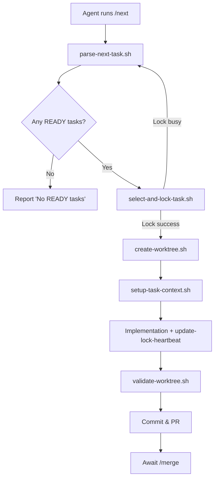
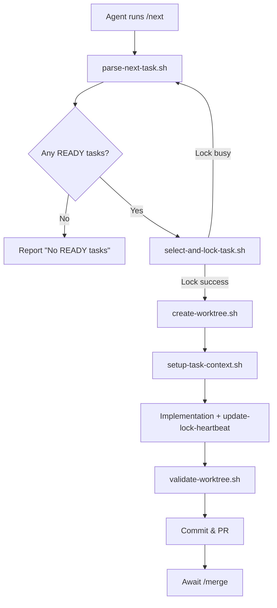
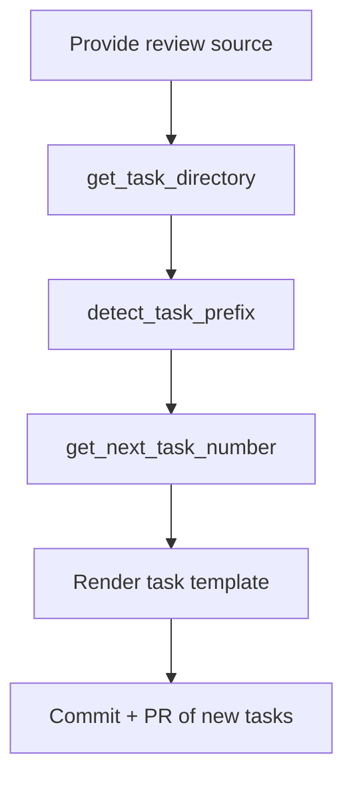

# Task Orchestration & Multi-Agent Workflow

This document explains how the `/next`, `/merge`, and `/start-review` commands cooperate with every
script under `.claude/scripts/` and the tmux "cloud-agents" workspace. It follows the code-explain
brief by layering insight from high-level intent down to individual algorithms, diagrams, practical
walkthroughs, pitfalls, and learning exercises.

---

## 1. Complexity Snapshot

| Subsystem                              | Main Responsibilities                                                                                                    | Key Scripts / Files                                                                                                                                  | Complexity Notes                                                                                                         |
| -------------------------------------- | ------------------------------------------------------------------------------------------------------------------------ | ---------------------------------------------------------------------------------------------------------------------------------------------------- | ------------------------------------------------------------------------------------------------------------------------ |
| Task intake (`/next`)                  | Clean stale locks, pick highest READY task, acquire lock, spin up worktree, hydrate context                              | `parse-next-task.sh`, `select-and-lock-task.sh`, `cleanup-stale-locks.sh`, `create-worktree.sh`, `setup-task-context.sh`, `update-lock-heartbeat.sh` | Atomically links lock files under `.git/task-locks/`, handles dependency graph, GitHub assignment checks, crash recovery |
| Implementation loop                    | Do work, keep lock fresh, run validation, monitor worktrees                                                              | `validate-worktree.sh`, `update-lock-heartbeat.sh`, `worktree-status.sh`, `list-task-locks.sh`, tmux `cloud-agents`                                  | Validation auto-detects mono vs single repos, watchers surface stale locks in real time                                  |
| Review decomposition (`/start-review`) | Parse audits into discrete tasks without locking                                                                         | `start-review.md`, `lib/get-task-directory.sh`, `lib/detect-task-prefix.sh`, `lib/get-next-task-number.sh`                                           | Atomic counter kept beside lock directory prevents numbering races                                                       |
| Merge + cleanup (`/merge`)             | Merge PRs, delete branches/worktrees/locks, support manual merge fallbacks                                               | `merge-pr.sh`, `manual-merge.sh`, `cleanup-merged-worktrees.sh`, `cleanup-task-lock.sh`                                                              | Provider-aware (GitHub/Azure), minimizes API calls, trap-based cleanup ensures locks vanish only after merge succeeds    |
| Supporting utilities                   | Monitor & maintain health of locks/worktrees/directories                                                                 | `clean-stale-locks.sh`, `unlock-task.sh`, `audit-directory-handling.sh`, `fix-directory-handling.sh`, `worktree-coordinator.ts`                      | Many scripts double as CI lint/fixers; TS coordinator offers programmatic control for future agents                      |
| VS Code & tmux UX                      | Developer ergonomics: `vscode-next.sh`, tmux `cloud-agents.yml`, `bin/tmux/monitor-locks.sh`, `bin/tmux/task-monitor.sh` | Provide dashboards and shortcuts; tmux session pre-cleans locks and streams telemetry                                                                |

---

## 2. Visual Diagrams

### `/next` Execution Flow



### `/merge` Cleanup Pipeline



### `/start-review` Task Generation



---

## 3. Step-by-Step Breakdown

### 3.1 Task Selection & Locking

1. `parse-next-task.sh` (invoked by `/next`) cleans stale locks via `cleanup-stale-locks.sh` before
   calling `select-and-lock-task.sh`.
2. `select-and-lock-task.sh` walks every `docs/tasks/*.md`, filters `status: READY`, ensures all
   `depends_on` items are `COMPLETED`, sorts by priority (`P0`-`P3`), and atomically `ln` links a
   JSON lock into `.git/task-locks/<TASK_ID>.lock`.
3. Lock contents include PID, agent ID, timestamps, and are updated regularly through
   `update-lock-heartbeat.sh` (called by `create-worktree.sh` and `setup-task-context.sh`).

### 3.2 Worktree Creation & Context

1. `create-worktree.sh` ensures Git cleanliness, resumes crashed worktrees, copies `.env` files,
   installs dependencies, and annotates lock metadata (`worktreePath`, `branch`).
2. `setup-task-context.sh` exports `MAIN_REPO`, `WORKTREE_ROOT`, `TASK_FILE`, and `PACKAGE_NAME`,
   halting if dependencies are missing.

### 3.3 Implementation & Validation

1. Developers work inside `.worktrees/<TASK_ID>`, keeping heartbeats alive implicitly via
   `update-lock-heartbeat.sh` (triggered by helper scripts or manual invocations).
2. `validate-worktree.sh` normalizes format/type/lint/test runs for both mono and single repos,
   showing skipped/failed statuses explicitly.

### 3.4 Merge & Cleanup

1. When ready, `/merge` runs `merge-pr.sh` (or `manual-merge.sh` for straight-to-main) to merge,
   prune, and delete locks.
2. Safety net scripts:
   - `cleanup-merged-worktrees.sh` sweeps already-merged branches.
   - `list-task-locks.sh`, `worktree-status.sh`, and `unlock-task.sh` surface and fix stragglers.

### 3.5 Review Decomposition

1. `/start-review` (documented in `start-review.md`) sources `lib/get-task-directory.sh` and
   `lib/detect-task-prefix.sh`, then allocates IDs via `lib/get-next-task-number.sh` or
   `next-task-id.sh`.
2. Generated tasks always start in `READY` without locks, letting `/next` resume the normal
   pipeline.

---

## 4. Algorithm Visualizations

### 4.1 Lock Arbitration Logic

```text
select-and-lock-task.sh(taskDir):
1. Build TASK_LIST = every READY task with deps satisfied.
2. Sort TASK_LIST by priority + ID.
3. For each task:
   a. try_create_lock() writes metadata to temp file and atomically ln's it.
   b. On success -> emit JSON + tmux notification, exit.
   c. On failure -> continue (another agent beat you).
4. If no locks succeeded -> report "all tasks locked".
```

### 4.2 Worktree Crash Recovery Snapshot

```text
create-worktree.sh(taskId):
- If worktree exists:
  * Ensure branch matches `feat/<TASK_ID>-slug`.
  * Display pending commits and `git status` to guide resume.
- Else:
  * `git worktree add -b feat/<TASK_ID>-slug .worktrees/<TASK_ID> main`.
  * Copy env files, install deps, pulse lock heartbeat.
```

### 4.3 Lock Cleanup Determination

```text
cleanup-stale-locks.sh --max-age N:
for each lock:
  minutes_since(heartbeat) >= N  -> remove
  branch merged into main         -> remove
  status == COMPLETED             -> remove
else -> show in Active table
```

---

## 5. Interactive Command Walkthroughs

### `/next` Hands-On

```bash
# 1. Reserve a task (already handles locking)
~/.claude/scripts/parse-next-task.sh --output-json

# 2. Create worktree + branch
~/.claude/scripts/create-worktree.sh MPCU-0017

# 3. Hydrate context in current shell
source ~/.claude/scripts/setup-task-context.sh MPCU-0017

# 4. Validate repeatedly while coding
~/.claude/scripts/validate-worktree.sh "$WORKTREE_ROOT" "$PACKAGE_NAME"
```

### `/start-review` Mini-Lab

```bash
# Prepare environment variables automatically
source ~/.claude/scripts/lib/get-task-directory.sh
source ~/.claude/scripts/lib/detect-task-prefix.sh
TASK_DIR=$(get_task_directory)
PREFIX=$(detect_task_prefix "$TASK_DIR")

# Generate next ID for note-taking (optional)
~/.claude/scripts/next-task-id.sh "$PREFIX"
```

### `/merge` Confidence Check

```bash
# Merge the PR tied to current worktree
~/.claude/scripts/merge-pr.sh --current

# If you have a PR number handy
~/.claude/scripts/merge-pr.sh 123

# Manual, no-PR flow
~/.claude/scripts/manual-merge.sh feat/MPCU-0017-add-retry
```

---

## 6. Common Pitfalls & Best Practices

| Pitfall                                          | Why it Hurts                                               | Mitigation                                                                                          |
| ------------------------------------------------ | ---------------------------------------------------------- | --------------------------------------------------------------------------------------------------- |
| Re-running `/next` after a successful lock       | Creates duplicate locks, starving other agents             | Trust the first JSON payload; use `list-task-locks.sh` if you lose context                          |
| Editing in the main repo instead of the worktree | Leads to dirty index and blocked worktree creation         | Always use `.worktrees/<TASK_ID>`; `create-worktree.sh` enforces a clean main tree                  |
| Skipping validation                              | Breaks CI consistency and invalidates automation contracts | Treat `validate-worktree.sh` as mandatory; script fails hard on missing `typecheck`/`test`          |
| Forgetting to merge before unlocking             | Leaves orphaned branches/PRs with no owner                 | Only `unlock-task.sh` when abandoning work; otherwise rely on `/merge` cleanup                      |
| Ignoring tmux monitors                           | Stale locks silently block `/next` consumers               | Keep `cloud-agents` session running so `monitor-locks.sh` and `task-monitor.sh` broadcast anomalies |

---

## 7. tmux Control Room Overview

`config/tmuxinator/cloud-agents.yml` provisions:

- **Monitor window**: `bin/tmux/monitor-locks.sh` live-refreshes locks; `bin/tmux/task-monitor.sh`
  streams throughput stats.
- **Workers window**: four panes primed to run the Claude CLI or helper scripts
  (`tmux/workers/next-worker.sh`).
- **Logs window**: Tails `.git/task-locks/history.log` and periodically runs `git worktree list`
  watcher.
- Project start/stop hooks automatically ensure `.git/task-locks/` exists and run
  `cleanup-stale-locks.sh --quiet` so stale locks never survive restarts.

Use this session as the operational cockpit—agents, humans, and cron jobs can all observe the same
state.

---

## 8. Supporting & "Orphan" Scripts

| Script                                                                   | Status               | Notes / When to Use                                                                                                         |
| ------------------------------------------------------------------------ | -------------------- | --------------------------------------------------------------------------------------------------------------------------- |
| `find-next-task.sh`                                                      | **Legacy**           | Early selector without atomic locking; keep for debugging but prefer `parse-next-task.sh` + `select-and-lock-task.sh`.      |
| `vscode-next.sh`                                                         | **VS Code UX**       | Mirrors `/next` behavior and opens the resulting worktree in a new VS Code window; handy for single-user desktop flows.     |
| `worktree-coordinator.ts`                                                | **Programmatic API** | TypeScript coordinator for future Node-based agents. Implements the same lock/worktree semantics with crash recovery hooks. |
| `audit-directory-handling.sh` / `fix-directory-handling.sh`              | **Maintenance**      | Enforce shell best practices (`set -e`, absolute paths). Helps keep helper scripts production-grade.                        |
| `detect-git-provider.sh`                                                 | **Shared Utility**   | Used by `merge-pr.sh` to switch between GitHub and Azure DevOps automatically.                                              |
| `next-task-id.sh`                                                        | **Shared Utility**   | Atomic counter for generating new IDs during `/start-review` task creation.                                                 |
| `cleanup-task-lock.sh`, `cleanup-stale-locks.sh`, `clean-stale-locks.sh` | **Ops**              | Remove stale or explicit locks; invoked manually or via tmux hooks/runbooks.                                                |
| `list-task-locks.sh`, `unlock-task.sh`, `worktree-status.sh`             | **Observability**    | Provide dashboards and bespoke remediation beyond tmux UI.                                                                  |

These scripts are not invoked directly by `/next`/`/merge`, but they round out the operating toolbox
and should be kept in sync with lock-directory conventions.

---

## 9. Best-Practice Recipes

1. **Recover from Crash**
   ```bash
   git worktree list
   source ~/.claude/scripts/setup-task-context.sh MPCU-0017
   ~/.claude/scripts/validate-worktree.sh "$WORKTREE_ROOT" "$PACKAGE_NAME"
   ```
2. **Clear a Stuck Task Quickly**
   ```bash
   ~/.claude/scripts/list-task-locks.sh
   ~/.claude/scripts/unlock-task.sh MPCU-0017
   ~/.claude/scripts/cleanup-merged-worktrees.sh
   ```
3. **Daily Hygiene (cron-friendly)**
   ```bash
   ~/.claude/scripts/cleanup-stale-locks.sh --max-age 30 --quiet
   ~/.claude/scripts/cleanup-merged-worktrees.sh
   ```

---

## 10. Learning Path & Practice Ideas

| Week | Focus                     | Suggested Exercise                                                                                                |
| ---- | ------------------------- | ----------------------------------------------------------------------------------------------------------------- |
| 1    | Understand lock lifecycle | Trace a task from `/next` through `select-and-lock-task.sh`, inspect lock JSON, and explain every field.          |
| 2    | Worktree internals        | Modify `create-worktree.sh` to log additional metadata, then resume a crashed worktree to see recovery messaging. |
| 3    | Merge automation          | Run `/merge --current`, then purposely break it (e.g., missing PR) to observe guardrails.                         |
| 4    | Review generation         | Use `/start-review` against a sample audit, then adjust `detect_task_prefix` to support a new prefix.             |
| 5    | Monitoring                | Extend `worktree-status.sh` to emit JSON and feed it into an external dashboard.                                  |

**Practice Projects**

- _Beginner_: Write a wrapper that runs `/next`, opens the worktree in your editor, and sends a
  desktop notification.
- _Intermediate_: Add a new validator (e.g., `pnpm security-audit`) to `validate-worktree.sh` and
  gate it behind a config flag.
- _Advanced_: Integrate `worktree-coordinator.ts` into a Node service that dispatches tasks to
  multiple agents and reconciles lock heartbeats.

---

## 11. Quick Reference

- List locks: `~/.claude/scripts/list-task-locks.sh --watch 2`
- Remove stale ones: `~/.claude/scripts/cleanup-stale-locks.sh --max-age 20`
- Observe worktrees: `~/.claude/scripts/worktree-status.sh`
- Unlock manually: `~/.claude/scripts/unlock-task.sh MPCU-0008`
- VS Code shortcut: `~/.claude/scripts/vscode-next.sh`

Keep this README handy whenever you need to reason about the automation stack or onboard new
contributors to the task management system.

---

## 12. Future Plans (TaskDock)

| Focus Area                  | Planned Improvements                                                                                                                                                                                                                | Notes                                                                                                                                |
| --------------------------- | ----------------------------------------------------------------------------------------------------------------------------------------------------------------------------------------------------------------------------------- | ------------------------------------------------------------------------------------------------------------------------------------ |
| Front door CLI              | Introduce a `taskdock` command with subcommands (`next`, `worktree`, `merge`, `locks`, `review`) plus smart help text and JSON output mode.                                                                                         | Acts as the single entry point for humans and agents; typos return a friendly command catalog.                                       |
| Telemetry & correlation IDs | Every command emits newline-delimited JSON logs tagged with a correlation ID, command name, repo path, task ID, and recommended next actions.                                                                                       | Logs live both in `$HOME/.taskdock/logs/` and `<repo>/.taskdock/logs/` so maintenance agents can debug automation incidents quickly. |
| Config hierarchy & priming  | Layered config: TaskDock defaults → user-level `~/.taskdock/config.yaml` → repo-level `<repo>/.taskdock/config.yaml` → env vars → CLI flags. Introduce `taskdock init` to scaffold required keys (ticket prefixes, worktree paths). | Commands refuse to run until the repo is primed, guiding agents through setup automatically.                                         |
| Ticket generation settings  | Config enforces per-repo ticket prefixes (e.g., `MPCU`). Missing values surface actionable errors with pointers to `taskdock config set ...`.                                                                                       | Ensures `/next` and review pipelines always label work consistently.                                                                 |
| Concurrency & locking       | Apply `flock` (or similar) when writing configs/logs so multiple agents can run TaskDock safely.                                                                                                                                    | Prevents corrupted telemetry or racing config writes.                                                                                |
| Security & privacy          | Redact secrets before logging, offer opt-out telemetry flag, and keep logs scoped per repo when needed.                                                                                                                             | Keeps TaskDock usable across sensitive codebases.                                                                                    |
| Dependency & env doctor     | `taskdock doctor` checks for required binaries (git, jq/yq, pnpm, etc.), clean worktrees, and stale locks, returning both human text and JSON.                                                                                      | Gives supervising agents a quick health report.                                                                                      |
| Cross-shell compatibility   | Standardize on `#!/usr/bin/env bash`, audit scripts for POSIX-safe patterns, and document shell requirements.                                                                                                                       | Makes TaskDock portable across macOS/Linux and agent hosts.                                                                          |
| Error taxonomy              | Reserve exit codes (e.g., `10` config missing, `20` lock busy, `30` validation failure) + consistent structured error payloads.                                                                                                     | Supervising agents can react programmatically without parsing prose.                                                                 |
| Testing harness readiness   | Commands accept injectable paths, correlation IDs, and config files; placeholder fixtures live under `taskdock/tests/fixtures/`.                                                                                                    | Makes it easy to bolt on an automated harness later.                                                                                 |
| Versioning & docs           | Ship `taskdock version`, update onboarding docs (`CLAUDE.md`, tmux playbooks) to reference TaskDock, and keep diagrams in sync.                                                                                                     | Facilitates future upgrades and onboarding.                                                                                          |
